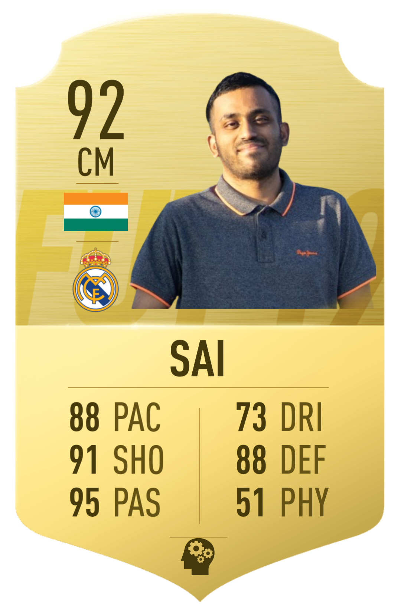

<!-- ABOUT THE REPOSITORY AND AUTHOR -->
<h2 id="about-the-repository-and-author"> Hi 👋 My name is Maniraj Sai</h2>

I'm a highly motivated and passion-driven AI Graduate specializing in Deep Learning, Natural Language Processing, and Computer Vision. With a Master’s in Artificial Intelligence from Rijksuniversiteit Groningen and a rich tapestry of experiences, I am on a mission to leverage AI to solve complex problems and drive innovation.

* 🌍  I'm based in Groningen.
* ✉️  You can contact me at [manirajadapa@gmail.com](mailto:manirajadapa@gmail.com).
* 🤝  I'm open to collaborating on any fun data visualizations with football involved in it.
* 🚀 Fun Fact: I love playing video games.

 

 

