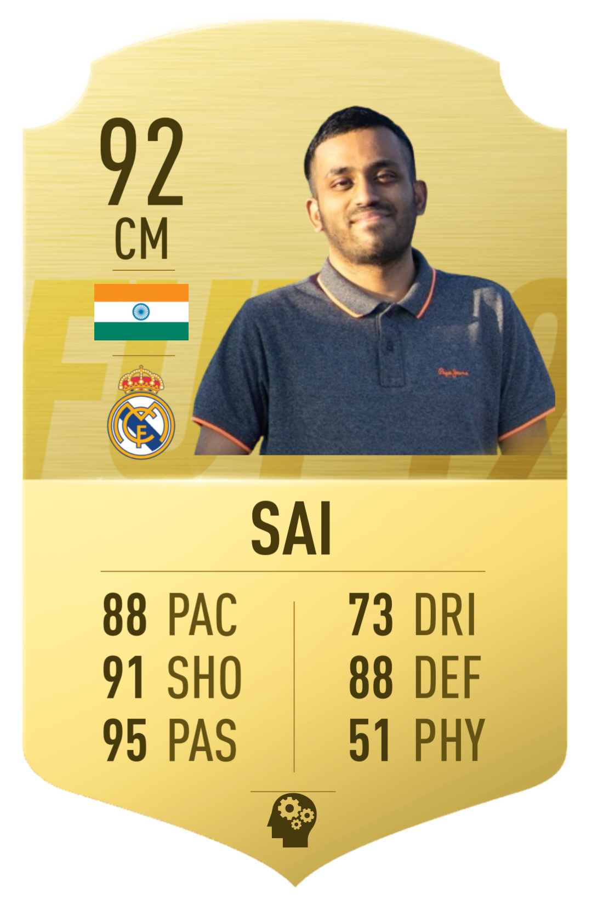

<!-- ABOUT THE REPOSITORY AND AUTHOR -->
<h1 id="about-the-repository-and-author"> Hi 👋 My name is Maniraj Sai</h1>

I work with LLMs (Mostly Local Ones).

* 🌍  I'm based in Arnhem.
* ✉️  You can contact me at [manirajadapa@gmail.com](mailto:manirajadapa@gmail.com).

 

### 📈 Let's Connect!
I am passionate about connecting with fellow AI enthusiasts, professionals, and anyone intrigued by the potential of Artificial Intelligence. Whether it's a project that leverages AI in creative ways, a discussion on the latest AI trends, or simply brainstorming over innovative ideas, I am all ears. 

