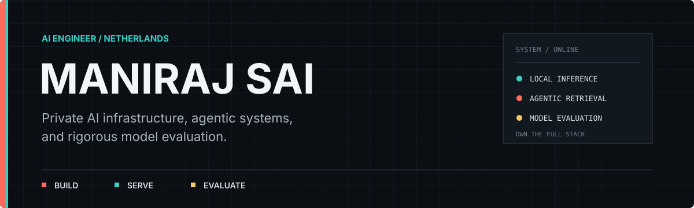

  

  
  
  
  

I am an AI engineer interested in the whole system behind a model: how it is trained, served, evaluated, grounded, and made useful in the real world.

At **aXite Security Tools**, I help build privacy-first AI for critical infrastructure. My work spans local model serving, agentic RAG, document intelligence, speech, evaluation, and the infrastructure that keeps every inference inside the customer's environment.

<table>
  <tr>
    <td width="33%"><strong>Build</strong> Transformers, training pipelines, data curation, instruction tuning</td>
    <td width="33%"><strong>Serve</strong> vLLM, on-premise inference, OpenAI-compatible APIs, GPU systems</td>
    <td width="33%"><strong>Evaluate</strong> Reproducible benchmarks, telemetry, retrieval quality, uncertainty</td>
  </tr>
</table>

## Selected work

### [AX-Office.ai](https://www.notion.so/AX-Office-ai-How-We-Built-Local-AI-Into-the-Heart-of-Our-Office-323a490c257c81beb4e4e022ded8bfcc)

**Local AI for organizations where data cannot leave the building.** I contributed to a production platform that combines private chat, a custom multi-agent RAG system, meeting transcription, document OCR, coding assistance, and continuous model evaluation. The stack runs on owned infrastructure with no external inference dependency.

`on-premise AI` `agentic RAG` `vLLM` `FastAPI` `Qdrant` `PostgreSQL` `Redis` `Docker`

### [Model Arena](https://github.com/thecr7guy2/model-arena)

**A living benchmark for the models we actually serve.** Twelve frozen tasks preserve original artifacts, side-by-side outcomes, Fable scores, and measured vLLM telemetry in a public, reproducible evaluation surface.

`LLM evaluation` `vLLM telemetry` `Next.js` `reproducibility`

### [GPT-2 from scratch](https://huggingface.co/thecr7guy/gpt2-pretrain)

**A 125M-parameter language model trained end to end.** I curated and tokenized an 18B-token, 120GB corpus, built memory-mapped data loading, and trained across 8x A100 GPUs in roughly eight hours. I then instruction-tuned the model and evaluated it against the original GPT-2 with EleutherAI's harness.

[Training write-up](https://bramble-hickory-105.notion.site/How-I-trained-an-LLM-from-scratch-and-finetuned-it-271a490c257c80718ffcf42b6d90e962) / [Pretrained model](https://huggingface.co/thecr7guy/gpt2-pretrain) / [Instruction-tuned model](https://huggingface.co/thecr7guy/gpt2-insFT) / [Implementation](https://github.com/thecr7guy2/GPTorch)

### Shot technique analysis for Ajax

**Turning 3D player tracking into coaching feedback.** At the Ajax Hackathon 2026, our team analyzed frame-level skeleton data from a live Eredivisie match, isolated 23 shots, and built a kinematics engine that scores how efficiently momentum travels through a player's shooting chain.

`sports analytics` `3D kinematics` `biomechanics` `data visualization`

## More experiments

- [World Cup Agents](https://github.com/thecr7guy2/worldcup-agents) - seven frontier models forecast the 2026 tournament and manage virtual $1M bankrolls.
- [Jobfinder](https://github.com/thecr7guy2/jobfinder) - discovers roles, ranks fit, sends alerts, tracks applications, and drafts tailored cover letters.
- [Agent Trading](https://github.com/thecr7guy2/agent-trading) - turns public insider and congressional disclosures into transparent paper-portfolio decisions.
- [DutchInquire](https://github.com/thecr7guy2/DutchInquire) - retrieval and question answering over Dutch-language documents.

## Research

**[Uncertainty Estimation for Super-Resolution Using ESRGAN](https://doi.org/10.5220/0013150700003912)** 
Maniraj Sai Adapa, Marco Zullich, and Matias Valdenegro-Toro. VISAPP 2025.

We combined ESRGAN with Monte Carlo Dropout and deep ensembles to produce calibrated, per-pixel uncertainty maps without sacrificing super-resolution performance.

## Toolkit

  
  
  
  
  
  
  
  
  
  

Based in the Netherlands. Building private AI systems from research to production.

