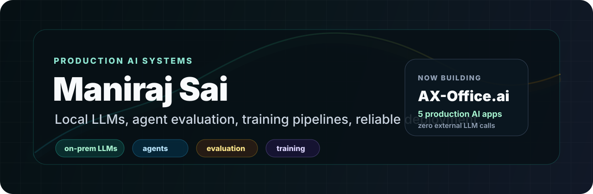

  

  
  
  
  

## I build AI systems that survive contact with production.

I work on the part of AI that usually gets ignored in demos: latency budgets, evaluation gates, messy retrieval, local model serving, observability, and deployment constraints for teams that cannot leak sensitive data to outside APIs.

Currently building **AX-Office.ai**, an on-prem LLM platform powering five production apps inside a security company.

<table>
  <tr>
    <td width="33%" valign="top">
      <h3>Systems</h3>
      
Local-first LLM apps, RAG, OCR, ASR, agent workflows, FastAPI services.

    </td>
    <td width="33%" valign="top">
      <h3>Reliability</h3>
      
Eval harnesses, model regression checks, observability, deployment discipline.

    </td>
    <td width="33%" valign="top">
      <h3>Training</h3>
      
PyTorch, SFT, distributed training, benchmarking open-source models.

    </td>
  </tr>
</table>

## Featured work

| Project | What it is | Stack |
|---|---|---|
| **[AX-Office.ai](https://bramble-hickory-105.notion.site/AX-Office-ai-How-We-Built-Local-AI-Into-the-Heart-of-Our-Office-323a490c257c81beb4e4e022ded8bfcc)** | On-prem AI platform with five production apps and zero external LLM calls. | `vLLM` `RAG` `ASR` `OCR` `FastAPI` |
| **[SEC filing trader](https://bramble-hickory-105.notion.site/I-Built-a-Bot-That-Reads-SEC-Filings-and-Lets-Claude-Opus-Manage-My-Portfolio-323a490c257c81739909cb792452185a)** | Agent that reads insider SEC filings and manages a live portfolio. | `Anthropic SDK` `agents` `Python` `Postgres` |
| **[GPT-2 124M from scratch](https://bramble-hickory-105.notion.site/How-I-trained-an-LLM-from-scratch-and-finetuned-it-271a490c257c80718ffcf42b6d90e962)** | Pretrained a 124M GPT-2 on 18B curated tokens, then instruction-tuned it. | `PyTorch` `pretraining` `SFT` |
| **Ajax shot analyzer** | Computer-vision pipeline for football shooting technique and 3D skeleton visualization. | `MediaPipe` `OpenCV` `Three.js` |
| **ESRGAN with uncertainty** | Master's thesis on medical-image super-resolution with calibrated uncertainty. | `PyTorch` `ESRGAN` `Bayesian DL` |

## Toolbox

| Area | Tools |
|---|---|
| LLM systems | `Python` `vLLM` `Hugging Face` `Anthropic SDK` `RAG` |
| Training | `PyTorch` `SFT` `distributed training` `model benchmarking` |
| Backend | `FastAPI` `Docker` `Linux` `GitHub Actions` |
| Data | `PostgreSQL` `pgvector` `evaluation datasets` |
| Interests | `agent reliability` `local AI` `football analytics` |

## Writing

- [How I trained an LLM from scratch and fine-tuned it](https://bramble-hickory-105.notion.site/How-I-trained-an-LLM-from-scratch-and-finetuned-it-271a490c257c80718ffcf42b6d90e962)
- [AX-Office.ai: building local AI into the heart of an office](https://bramble-hickory-105.notion.site/AX-Office-ai-How-We-Built-Local-AI-Into-the-Heart-of-Our-Office-323a490c257c81beb4e4e022ded8bfcc)
- [A trading bot that reads SEC filings, run by Claude Opus](https://bramble-hickory-105.notion.site/I-Built-a-Bot-That-Reads-SEC-Filings-and-Lets-Claude-Opus-Manage-My-Portfolio-323a490c257c81739909cb792452185a)

  
  

  Build useful systems. Ship the boring parts well. Read the logs.

